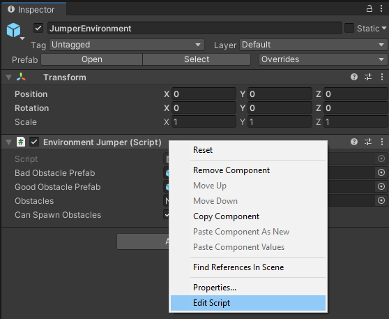
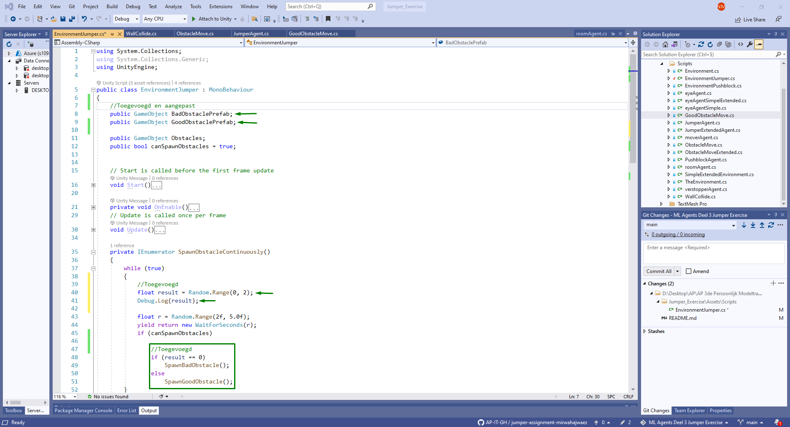
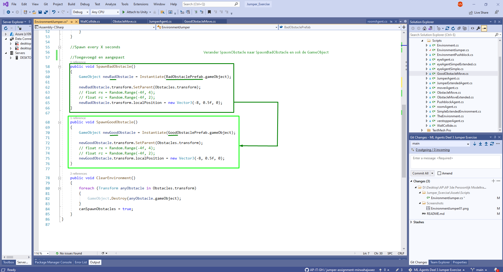
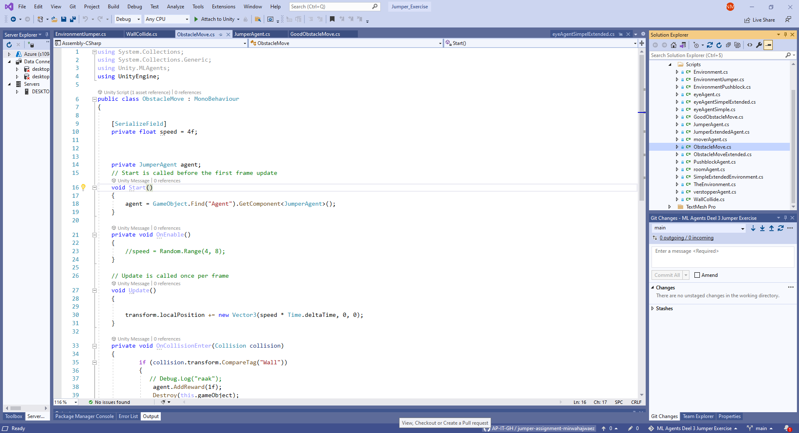
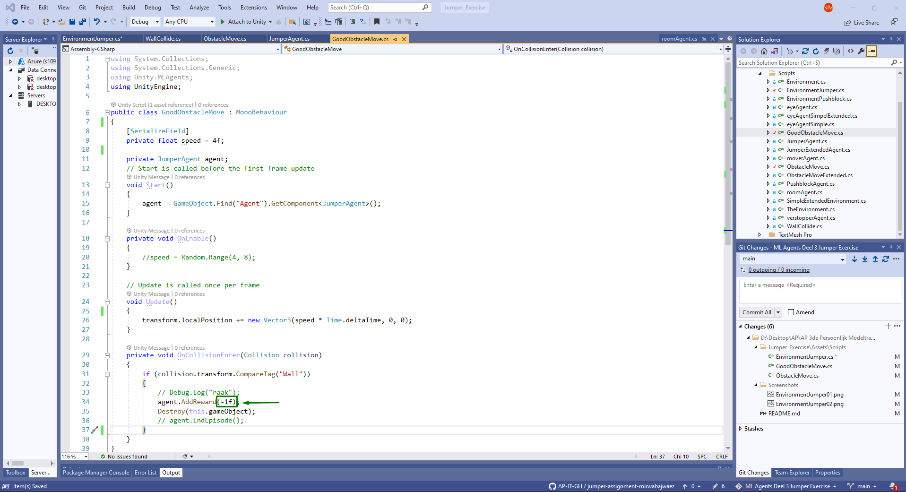
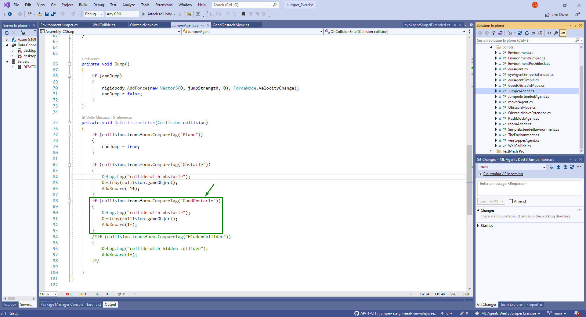

# ML Agents Deel 3: Jumper Exercise

## Nabil El Moussaoui & Mirwahaj Waez


## Benodigdheden:
-   Unity
-   Visual Studio
-   Pytorch
-   Anaconda
-   ML-Agents release 2.0.0

### Verloop van het spel:

Om de opdracht tot een goed einde te brengen dien je eerst de volgende github repository te downloaden: 
https://github.com/tomptrs/MLAgents-Klas-Voorbeeld/tree/master

## Unity Project Opstellen

### Stap 1

Wij stellen voor om als eerste stap een aantal voorbeelden te bekijken om zo inspiratie op te doen.

### Stap 2

Open de 'MLAgents-Klas-Voorbeeld' in Unity Hub en ga naar de folder Assets.

### Stap 3

In de assets folder ga open je "Jumper" scene.

### Stap 4

Daarna ga je in de hierarchie de environment game object veranderen naar "JumperEnvironment"

## Scripts

### Stap 1
In de JumperEnvironment veranderen we de script "EnvironmentJumper.cs", dubbelklik op "EnvironmentJumper.cs" en open dat in Visual Studio


### Stap 2
- Voeg 2 GameObjects velden toe genaamd "BadObstaclePrefab" en "GoodObstaclePrefab".
- In de "private IEnumerator SpawnObstacleContinuously()" voeg je een float result met een Random range van 0 tot 2. Daarbij zet je een Debug.Log(result) aan toe om dit via de console te bekijken.
- binen de if-statement van (canSpawnObstacles) verander je heel het structuur naar:
```csharp
if (result == 0)
        SpawnBadObstacle();
    else
        SpawnGoodObstacle();
```


- Dupliceer deze methode "public void SpawnObstacle()" en verander de eerste naar "public void SpawnBadObstacle()" en de tweede naar "public void SpawnGoodObstacle()".
- Verander ook de velden binnen deze functies naar de gepaste naam.



### Stap 3
Ga naar de volgende Script ObstacleMove.cs en maak daar een kopie van (door op CRTL+C te drukken).
- Hernoem ObstacleMove1.cs naar "ObstacleGoodMove.cs".
- In "ObstacleGoodMove.cs" verander je de AddReward methode in "private void OnCollisionEnter(Collision collision)" naar -1f ipv. 1f.





### Stap 4
Ga naar de volgende Script JumperAgent.cs.
- Bij de methode "private void OnCollisionEnter(Collision collision)" kopieer en plak:
```csharp
if (collision.transform.CompareTag("Obstacle"))
    {
        Debug.Log("collide with obstacle");
        Destroy(collision.gameObject);
        AddReward(-1f);           
    }
```
- En verander de CompareTag naar "GoodObstacle"
- En de AddReward naar "1f"




