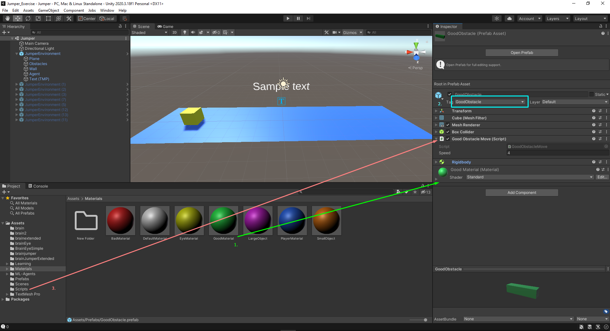
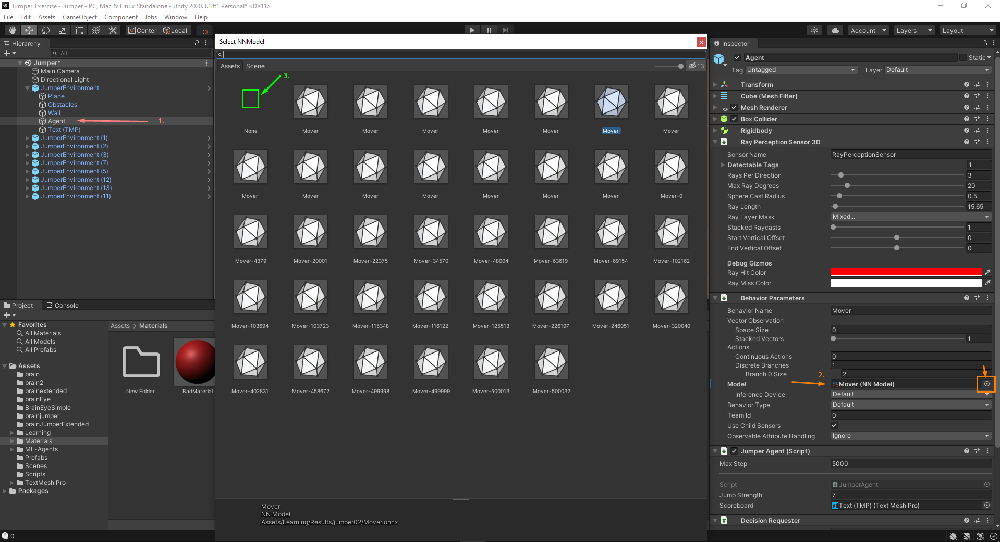
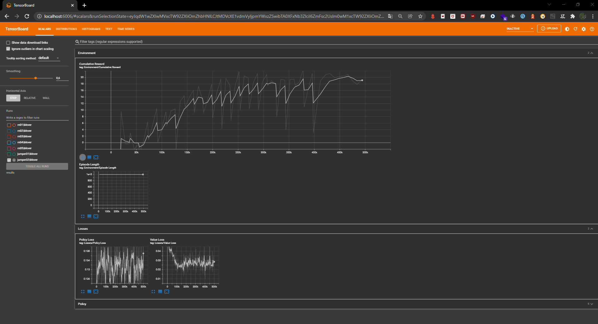

# ML Agents Deel 3: Jumper Exercise

## Nabil El Moussaoui & Mirwahaj Waez


## Benodigdheden:
-   Unity
-   Visual Studio
-   Pytorch
-   Anaconda
-   ML-Agents release 2.0.0

### Verloop van het spel:

Om de opdracht tot een goed einde te brengen dien je eerst de volgende github repository te downloaden: 
https://github.com/tomptrs/MLAgents-Klas-Voorbeeld/tree/master

## Unity Project Opstellen

### Stap 1

Wij stellen voor om als eerste stap een aantal voorbeelden te bekijken om zo inspiratie op te doen.

### Stap 2

Open de 'MLAgents-Klas-Voorbeeld' in Unity Hub en ga naar de folder Assets.

### Stap 3

In de assets folder ga open je "Jumper" scene.

### Stap 4

Daarna ga je in de hierarchie de environment game object veranderen naar "JumperEnvironment"

## Scripts

### Stap 1
In de JumperEnvironment veranderen we de script "EnvironmentJumper.cs", dubbelklik op "EnvironmentJumper.cs" en open dat in Visual Studio.


### Stap 2
- Voeg 2 GameObjects velden toe genaamd "BadObstaclePrefab" en "GoodObstaclePrefab".
- In de "private IEnumerator SpawnObstacleContinuously()" voeg je een float result met een Random range van 0 tot 2. Daarbij zet je een Debug.Log(result) aan toe om dit via de console te bekijken.
- binen de if-statement van (canSpawnObstacles) verander je heel het structuur naar:
```csharp
if (result == 0)
        SpawnBadObstacle();
    else
        SpawnGoodObstacle();
```


- Dupliceer deze methode "public void SpawnObstacle()" en verander het eerste naar "public void SpawnBadObstacle()" en de tweede naar "public void SpawnGoodObstacle()".
- Verander ook de velden binnen deze functies naar de gepaste naam.


### Stap 3
Ga naar de volgende Script ObstacleMove.cs en maak daar een kopie van (door op CRTL+C te drukken).
- Hernoem ObstacleMove1.cs naar "ObstacleGoodMove.cs".
- In "ObstacleGoodMove.cs" verander je de AddReward methode in "private void OnCollisionEnter(Collision collision)" naar -1f ipv. 1f.


### Stap 4
Ga naar de volgende Script JumperAgent.cs.
- Bij de methode "private void OnCollisionEnter(Collision collision)" kopieer en plak:
```csharp
if (collision.transform.CompareTag("Obstacle"))
    {
        Debug.Log("collide with obstacle");
        Destroy(collision.gameObject);
        AddReward(-1f);           
    }
```
- En verander de CompareTag naar "GoodObstacle"
- En de AddReward naar "1f"


## Unity

### Stap 1
1. Ga naar "Prefabs" in "Assets" folder.
2. Maak een Prefab van "JumperEnvironment" door dit te slepen naar de Prefab folder.
3. Dupliceer Obstacle prefab en verander het eerste naar "BadObstacle" en de tweede naar "GoodObstacle".
4. Selecteer de "JumperEnvironment" en sleep de BadObstacle prefab naar input van de "Environment Jumper (Script)". Doe dit hetzelfde voor de GoodObstacle prefab.


### Stap 2
1. Ga naar de folder "Materials" en sleep "GoodMaterial" naar de Shader in de GoodObstacle prefab.
2. Verander de tag van "Obstacle" naar "GoodObstacle".
3. Voeg de "GoodObstactleMove.cs" script naar de GoodObstacle prefab.



### Stap 3
1. Dupliceer JumperEnvironment en plaats ze ver uit elkaar.


### Stap 4
1. Selecteer de Agent object in de JumperEnvironment.
2. In de Inspector ga je naar de Behavior Parameters en klik je op het ronde icoontje bij het attribuut Model.
3. En hier selecteer je "none" en dan sluit je het NNModel.

Zo kunnen we de Agent vanaf scratch laten trainen.



## Anaconda

### Stap 1
Open Anaconda


### Stap 2
Selecteer de "Environments". Ga dan naar "unity_rl" en open dit in terminal.


### Stap 3
- Navigeer naar "./Jumper_Exercise/Assets/Learning"
- Run dan deze commando `mlagents-learn Mover.yaml --run-id [NAAM]`
- De `[NAAM]` mag je zelf kiezen bijvoorbeeld `jumperTest`.
- Als je Unity ziet en als de terminal begint te luisteren `[INFO] Listening on port [PORT]. Start training by pressing the Play button in the Unity editor.` Moet je dan op de Play button drukken. Dan begint de training van jouw Agent.


## Tensorboard

### Stap 1
- Als de learning voltooid is m.a.w. dat de agent zijn training heeft vervolledigd. Gaan we de dit op TensorBoard laten zien.
- Run deze commando in de terminal `tensorboard --logdir results`.
- Dan gaat de terminal een url meegeven met de gegevens om lokaal te hosten.
- Kopieer deze url.


### Stap 2
- Open je browser, plak dat url.
- Dan zie je de een preview van de resultaten die je hebt gerund.
- Links kan je de resultaten filteren.
- En als je op die fullscreen drukt bij Cumulatieve Reward dan vergroot je de grafiek.


## Configuratie
Voor de configuratie van onze `.yaml` file hebben we de huidige `Mover.yaml` gebruikt. De .yaml file gebruiken we om onze Agent te laten trainen op een zorgvuldige manier. Hieronder hebben we enkele configuraties waarvan max_steps laat tonen wanneer de training stopt. De summary_freq geeft de hoeveelheid stappen moet zich voordoen en waarbij we telkens daarop feedback krijgen hoe onze Reward verloopt. De informatie voor elke attribuut en parameters kunnen we hier terugvinden: [Training Configuration File](https://github.com/Unity-Technologies/ml-agents/blob/main/docs/Training-Configuration-File.md).

```yaml
behaviors:
  Mover:
    trainer_type: ppo
    hyperparameters:
      batch_size: 32
      buffer_size: 2048
      learning_rate: 0.0003
      beta: 0.005
      epsilon: 0.2
      lambd: 0.95
      num_epoch: 3
      learning_rate_schedule: linear
    network_settings:
      normalize: false
      hidden_units: 20
      num_layers: 1
      vis_encode_type: simple
    reward_signals:
      extrinsic:
        gamma: 0.9
        strength: 1.0
    keep_checkpoints: 5
    max_steps: 500000
    time_horizon: 3
    summary_freq: 2000
    threaded: true
```


## Resultaten

- Dit is de Cumulatieve Reward van Jumper01:\
Deze Agent heeft de AddReward(1f) bewerking wanneer de Agent tegen het groene balkje botst. De nieuwe wijziging van Jumper02 zit er niet in.


- Dit is de Cumulatieve Reward van Jumper02:\
Deze Agent heeft ook de AddReward(-1f) bewerking wanneer het groene balkje tegen de muur botst.



## Conclusie


